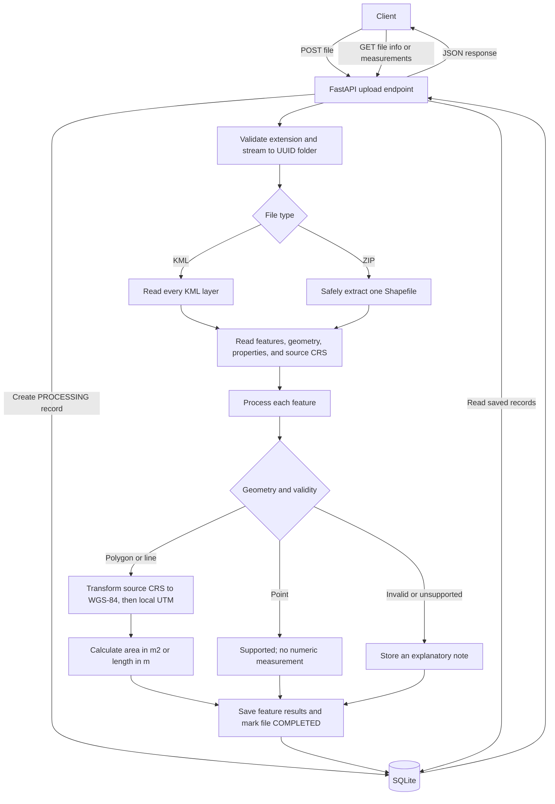

# Geospatial File Measurement API

A FastAPI service that accepts KML files and ZIP archives containing a Shapefile. It reads the features and their attributes, measures polygon area and line length in a projected coordinate system, and returns the results through a REST API. Point features are returned without a measurement, and unsupported or invalid geometries are reported per feature.

## Features

- Upload `.kml` files or `.zip` files containing exactly one Shapefile.
- Read all KML layers and preserve each feature's geometry, CRS, properties, and index.
- Calculate polygon area in square meters and hectares, and line length in meters and kilometers.
- Convert geometries to a local UTM projection before measuring; do not calculate measurements directly in longitude/latitude degrees.
- Return original geometry in the source CRS, with the CRS identified in each feature result.
- Handle invalid, empty, and unsupported geometries without failing the whole file.
- Apply upload size limits and ZIP extraction checks for path traversal and excessive uncompressed data.

## Requirements

- Python 3.10 or newer (Python 3.12 is a good choice for a new environment).
- Dependencies listed in `requirements.txt`.

## Setup

### Windows PowerShell

```powershell
py -3.12 -m venv .venv
.\.venv\Scripts\Activate.ps1
python -m pip install --upgrade pip
python -m pip install -r requirements.txt
python scripts/make_samples.py
python -m uvicorn app.main:app --reload
```

### macOS or Linux

```bash
python3 -m venv .venv
source .venv/bin/activate
python -m pip install --upgrade pip
python -m pip install -r requirements.txt
python scripts/make_samples.py
python -m uvicorn app.main:app --reload
```

The API listens at `http://127.0.0.1:8000`. Open `http://127.0.0.1:8000/docs` for interactive API documentation. On startup, the application creates its SQLite tables in `app.db` in the current working directory. Uploaded files are kept under `uploads/`.

### Optional: run with Docker

Build and start the API in one container:

```bash
docker build -t geo-measurement-api .
docker run --name geo-measurement-api -p 8000:8000 geo-measurement-api
```

Open `http://localhost:8000/docs` to use the API. Stop the container with `Ctrl+C`; restart the stopped container with `docker start -ai geo-measurement-api`. This is a minimal single-container setup for local use, not a production deployment. It does not configure persistent volumes or production hardening. The SQLite database and uploaded files remain when the container is stopped, but are lost if the container is removed. Add persistent volumes before using Docker for data you need to keep.

## API

Uploads use `multipart/form-data` with a field named `file`.

### Upload and process a file

`POST /api/files/`

PowerShell:

```powershell
curl.exe -F "file=@sample_data/sample.kml" http://127.0.0.1:8000/api/files/
curl.exe -F "file=@sample_data/sample_polygons.zip" http://127.0.0.1:8000/api/files/
```

macOS or Linux:

```bash
curl -F "file=@sample_data/sample.kml" http://127.0.0.1:8000/api/files/
curl -F "file=@sample_data/sample_polygons.zip" http://127.0.0.1:8000/api/files/
```

Example response (the generated ID and values depend on the uploaded file):

```json
{
  "id": "<generated-uuid>",
  "filename": "sample.kml",
  "feature_count": 3,
  "crs": "EPSG:4326",
  "status": "COMPLETED"
}
```

### Get file information

`GET /api/files/{id}/`

```bash
curl http://127.0.0.1:8000/api/files/YOUR_FILE_ID/
```

Replace `YOUR_FILE_ID` with the `id` returned by the upload endpoint. This returns the same file summary fields as the upload response.

### Get per-feature measurements

`GET /api/files/{id}/measurements/`

```bash
curl http://127.0.0.1:8000/api/files/YOUR_FILE_ID/measurements/
```

The response contains a feature list. Each feature includes its zero-based `index`, `geometry_type`, source `crs`, `properties`, GeoJSON `geometry`, `supported` flag, measurement values, `measurement_crs`, and an optional explanatory `note`. Geometry is included by default. To reduce response size, request `?include_geometry=false`; the `geometry` field is then `null`.

Example response from uploading `sample_data/sample.kml` and requesting its measurements (the file ID is generated for each upload):

```json
{
  "file_id": "<generated-uuid>",
  "crs": "EPSG:4326",
  "feature_count": 3,
  "features": [
    {
      "index": 0,
      "geometry_type": "Polygon",
      "crs": "EPSG:4326",
      "properties": {
        "Name": "Ripon Building Ground",
        "description": "Colonial building headquarters of Greater Chennai Corporation"
      },
      "geometry": {"type": "Polygon", "coordinates": [[[80.272, 13.082], [80.275, 13.082], [80.275, 13.085], [80.272, 13.085], [80.272, 13.082]]]},
      "supported": true,
      "area_sq_m": 107910.15926651264,
      "area_hectares": 10.791,
      "length_m": null,
      "length_km": null,
      "measurement_crs": "EPSG:32644",
      "note": null
    },
    {
      "index": 1,
      "geometry_type": "LineString",
      "crs": "EPSG:4326",
      "properties": {"Name": "Poonamallee High Road Segment", "description": "Arterial road connecting central Chennai westwards"},
      "geometry": {"type": "LineString", "coordinates": [[80.268, 13.081], [80.272, 13.0825], [80.276, 13.0835], [80.28, 13.0845]]},
      "supported": true,
      "area_sq_m": null,
      "area_hectares": null,
      "length_m": 1359.3716083399954,
      "length_km": 1.3594,
      "measurement_crs": "EPSG:32644",
      "note": null
    },
    {
      "index": 2,
      "geometry_type": "Point",
      "crs": "EPSG:4326",
      "properties": {"Name": "Chennai Central Railway Station Landmark", "description": "Major railway terminus in South India"},
      "geometry": {"type": "Point", "coordinates": [80.2755, 13.0827]},
      "supported": true,
      "area_sq_m": null,
      "area_hectares": null,
      "length_m": null,
      "length_km": null,
      "measurement_crs": null,
      "note": "no measurement for points"
    }
  ]
}
```

The example uses the default `include_geometry=true` behavior. With `?include_geometry=false`, each feature's `geometry` is `null`. The API also has `GET /health`, which returns `{"status":"ok"}`.

### Status codes

| Endpoint | Status | Meaning |
| --- | --- | --- |
| `POST /api/files/` | `201` | File processed successfully |
| `POST /api/files/` | `413` | Upload exceeds the configured size limit |
| `POST /api/files/` | `415` | Unsupported file extension |
| `POST /api/files/` | `422` | Invalid file content, missing Shapefile CRS, or no features |
| `POST /api/files/` | `500` | Unexpected processing error |
| Either `GET` file endpoint | `200` | File or measurements found |
| Either `GET` file endpoint | `404` | File ID not found |

## Architecture

```text
app/
  main.py                 FastAPI application, lifespan, and health endpoint
  config.py               Upload directory and size limits
  db.py                   SQLite engine, SQLAlchemy base, and DB dependency
  models.py               UploadedFile and FeatureRecord database tables
  schemas.py              Pydantic response models and derived units
  api/files.py            Upload, file information, and measurements endpoints
  services/
    errors.py             File-processing exception types
    ingest.py             Upload streaming and safe ZIP extraction
    reader.py             KML/Shapefile reading and property cleanup
    crs.py                CRS transformations and UTM selection
    measure.py             Geometry validation and measurement
    processing.py         Per-file orchestration and database persistence
tests/                    Unit and API tests
scripts/                  Sample data generation and reader spike
sample_data/              Example KML and Shapefile ZIP files
```



### File-processing flow

1. The upload endpoint checks the filename extension, assigns a UUID, and streams the upload to a fixed internal filename. It creates an `UploadedFile` database record with status `PROCESSING`.
2. For ZIP uploads, the ingestion service checks archive paths and actual extracted size, then requires exactly one `.shp` with `.shx` and `.dbf` companions. For KML, the reader discovers and reads every layer. A Shapefile must provide a readable CRS.
3. The reader returns a `ReadResult` containing both a display CRS string and a CRS object, plus `RawFeature` objects with an index, geometry, and JSON-safe properties. Z coordinates and KML styling fields are removed.
4. The processing service handles each feature independently, stores its original geometry as GeoJSON, and saves its properties and measurement result as a `FeatureRecord`. The upload record is then marked `COMPLETED`.

### Measurement flow

For each non-null geometry, the processing service transforms from the file's CRS to EPSG:4326. The measurement service checks whether the geometry is empty, valid, and supported. It projects polygons and lines into UTM, then uses Shapely's planar `.area` or `.length` in meter-based coordinates. The response schema derives hectares from square meters and kilometers from meters. Points are supported but have no numeric measurement.

### CRS handling & accuracy verification

KML coordinates are treated as EPSG:4326. Shapefile coordinates use the CRS read from the Shapefile's projection metadata; the application does not guess when that CRS is missing. Reprojection uses `always_xy=True` to keep coordinate order strictly as `(longitude, latitude)`.

UTM is selected from each feature's centroid, so a feature that crosses a zone boundary is measured wholly in one zone. The supported UTM latitude range is 80°S to 84°N.

The measurement tests compare selected polygon areas and line lengths against `pyproj.Geod` on WGS-84 using a `0.5%` relative tolerance. A test polygon that crosses a UTM zone boundary is also checked against this tolerance; these tests validate representative geometries, not a universal error bound for every possible feature. The degrees-trap test uses a $0.01^\circ \times 0.01^\circ$ square near Chennai: its planar Shapely area is `0.0001` square degrees, while the projected measurement is between `1.1` and `1.3` million square meters.

## Design decisions

| Decision | Alternative | Reason |
| --- | --- | --- |
| FastAPI | Django REST Framework | A small typed API with generated interactive docs fits the three main endpoints without ORM/admin overhead. |
| Synchronous processing | Background worker and task queue | The current flow is simpler for the intended file sizes; large jobs may need a queue (Celery/RQ) and status polling. |
| SQLite | PostgreSQL/PostGIS | SQLite keeps local setup simple; PostGIS would suit production spatial queries and concurrent use. |
| UTM zone per feature centroid | One projection for the whole file or geodesic measurement | UTM provides meter units for local measurements; geodesic calculations are used by tests as an independent comparison. |
| Flag invalid geometries | Repair with `make_valid` | Silent repair can alter submitted geometry; this API reports the problem with `explain_validity` instead. |
| Preserve geometry in source CRS | Return geometry in measurement CRS | Preserving source coordinates avoids changing the uploaded feature representation; the CRS is included in the response. |
| Read every KML layer | Read only the default layer | KML folders can be separate layers, so reading all layers avoids dropping features. |

## Testing

Run the test suite from the repository root:

```bash
python -m pytest -v
```

**Verified locally:** Python 3.12.9 and pytest 9.1.1 — **62 passed in 3.78 seconds**. The run also emitted 18 deprecation warnings: one from Starlette's TestClient/httpx integration, 11 from `datetime.utcnow()`, five from the deprecated HTTP 422 constant, and one from the deprecated HTTP 413 constant.

The suite covers:
- UTM zone calculation, polar bounds (-80..84), and longitude validation (-180..180).
- Geodesic accuracy cross-checks against `pyproj.Geod` within 0.5%.
- Zip-slip path traversal and zip bomb byte limit enforcement.
- Multi-layer KML reading, continuous indexing, and property sanitization.
- HTTP status codes (201, 200, 404, 413, 415, 422) and verification that 422/413 errors leave zero database rows and zero disk artifacts.

## Limitations

- Upload processing is synchronous and files are stored on local disk.
- SQLite is used; there is no authentication, pagination, or file deletion endpoint.
- ZIP uploads must contain exactly one Shapefile.
- Invalid geometries are flagged rather than repaired.
- A feature crossing UTM zones is measured in the single zone selected from its centroid. A documented zone-boundary test case had an area difference of about `+0.18%` compared with its geodesic result; this is one example, not a maximum-error guarantee.
- Features outside UTM's supported latitude range (-80° to 84°), or with invalid longitude values, are flagged as unsupported.

## Learning

1. **KML layers:** KML folders can appear as separate layers. The reader uses `pyogrio.list_layers(path)` and reads each layer so later folders are not silently left out.
2. **Coordinate order:** `always_xy=True` keeps transformations consistent with longitude as x and latitude as y.
3. **Attribute cleanup:** Spatial file properties may include dates, NumPy values, and missing values. These need conversion before they can be returned safely as JSON.
4. **Geometry diagnostics:** `shapely.validation.explain_validity(geom)` provides a reason for invalid geometries, rather than only saying that a geometry is invalid.

## Future scope

- **Background Job Queue:** Introduce Celery/Redis or ARQ for asynchronous background processing with status polling and webhooks for massive archives (>100 MB).
- **PostGIS Integration:** Replace SQLite with PostgreSQL/PostGIS for high-concurrency spatial queries, spatial indexing (R-Tree / GiST), and polygon intersections.
- **Drone Survey Analytics (Aereo Domain):** Extend measurements to calculate polygon perimeter, bounding box dimensions, and elevation/cut-and-fill volume profiles from digital elevation models (DEM / GeoTIFF).
- **Format Expansion:** Support GeoJSON, FlatGeobuf, and GeoPackage uploads with automatic spatial schema detection.
- **Optional Assisted Repair:** Provide an optional `?repair_invalid=true` query parameter leveraging `shapely.make_valid`, reporting both original and repaired geometries.

---

*Built with AI assistance (Antigravity agent).*
